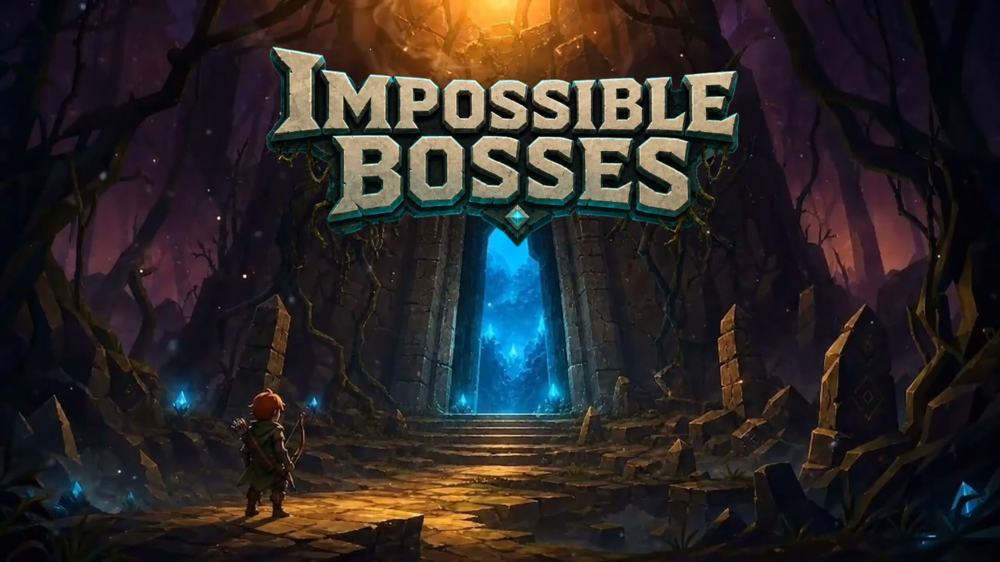
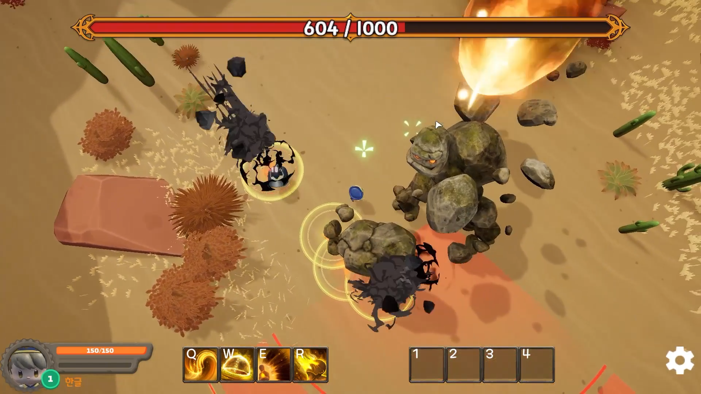
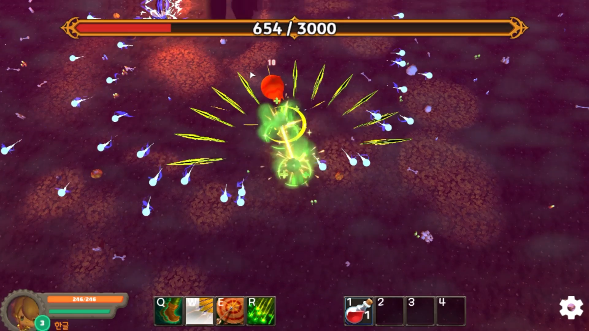
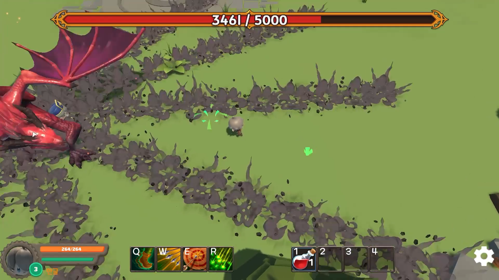
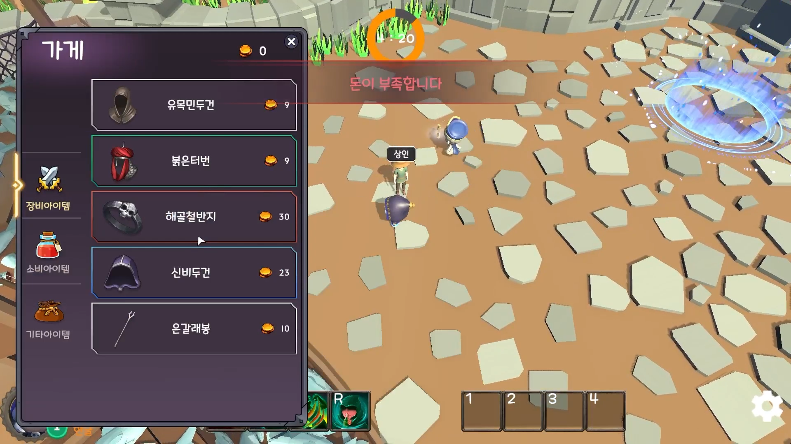
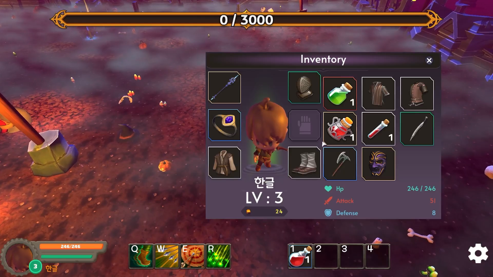

  
    
  

---

<table width="860" border="0" cellpadding="0" cellspacing="0" bgcolor="#0d1117">
<tr>
<td colspan="5" bgcolor="#303944" height="2"></td>
</tr>
<tr>
<td bgcolor="#303944" width="2"></td>
<td bgcolor="#171d23" width="856">
<table width="856" border="0" cellpadding="10" cellspacing="0" bgcolor="#171d23">
<tr>
<td rowspan="6" width="470" valign="top" bgcolor="#171d23">

</td>
<td rowspan="6" width="246" valign="top" bgcolor="#171d23">

  
<b>ImpossibleBosses</b>
 
Team up online and challenge powerful boss raids.
  
Genre
 
<b>Co-op Boss Raid</b>
  
Platform
 
<b>Steam</b>
  
Status
 
<b>Wishlist Now</b>
</td>
<td width="74" valign="top" bgcolor="#171d23">

</td>
</tr>
<tr>
<td width="74" valign="top" bgcolor="#171d23">

</td>
</tr>
<tr>
<td width="74" valign="top" bgcolor="#171d23">

</td>
</tr>
<tr>
<td width="74" valign="top" bgcolor="#171d23">

</td>
</tr>
<tr>
<td width="74" valign="top" bgcolor="#171d23">

</td>
</tr>
<tr>
<td width="74" valign="top" bgcolor="#171d23">

</td>
</tr>
</table>
</td>
<td bgcolor="#303944" width="2"></td>
</tr>
<tr>
<td colspan="5" bgcolor="#303944" height="2"></td>
</tr>
</table>

