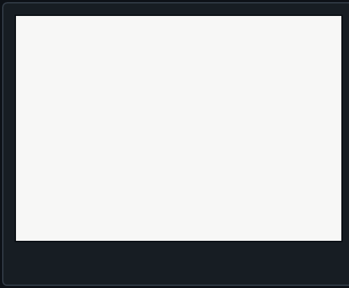
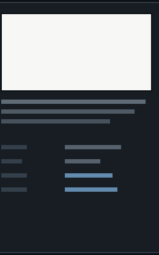
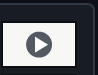
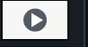
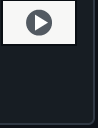

  
    
  

---

<table width="860" border="0" cellpadding="0" cellspacing="0">
<tr>
<td rowspan="6" width="502" height="415">

</td>
<td rowspan="6" width="260" height="415">

</td>
<td width="98" height="75">

</td>
</tr>
<tr>
<td width="98" height="53">

</td>
</tr>
<tr>
<td width="98" height="53">

</td>
</tr>
<tr>
<td width="98" height="53">

</td>
</tr>
<tr>
<td width="98" height="53">

</td>
</tr>
<tr>
<td width="98" height="128">

</td>
</tr>
</table>

